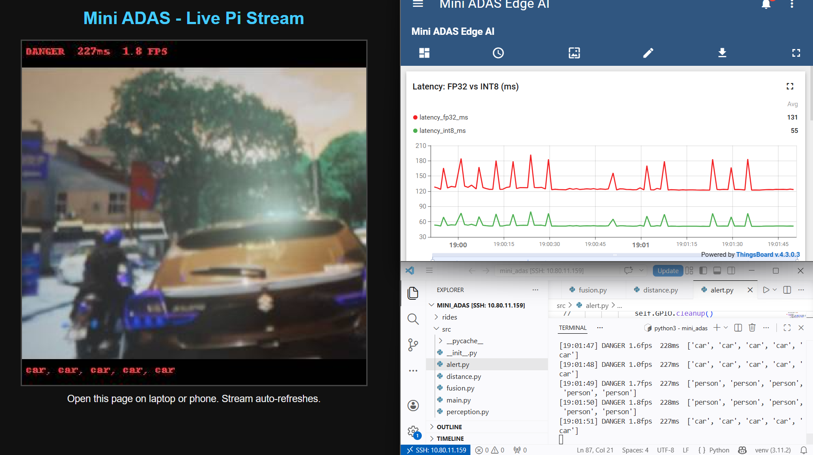
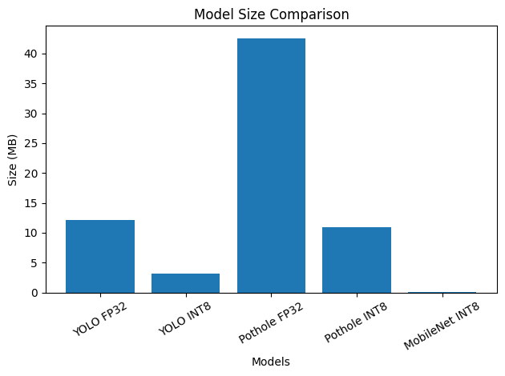
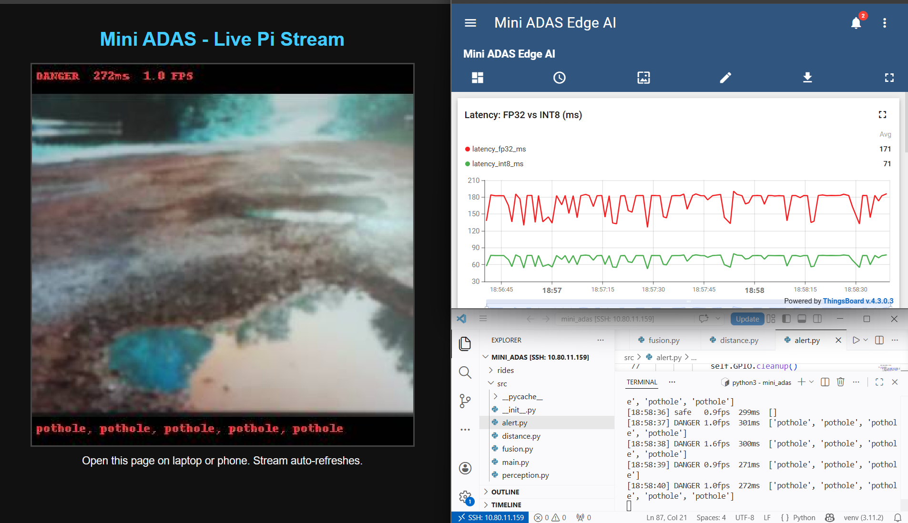

# Edge AI-Based Forward Collision Warning System (Mini ADAS)

**Course:** CP 330 Edge AI, IISc Bangalore, 2025–26
**Team:** G. Praveen Kumar (27480) · Harshith L (25823) · Ramavath Ramadas (26671) 
**GitHub:** https://github.com/pkgollapalli/Edge-AI-Based-Forward-Collision-Warning-System-Mini-ADAS-.git

---

## 1. Problem Statement, Motivation & Objectives

India records over 4.6 lakh road crashes per year, killing 1.7 lakh people annually. Rear-end collisions are among the top contributors — at 40 km/h a distracted driver covers 20 metres before reacting. Modern Forward Collision Warning (FCW) systems exist in premium cars but are completely absent from vehicles that need them most: two-wheelers, autorickshaws, school buses, and older cars — over 90% of Indian road traffic. Additionally, all major public ADAS datasets (KITTI, BDD-100K, Waymo Open) are from Western roads and are blind to Indian-specific objects: autorickshaws recall 0%, bicycles 2.7%, zebra crossings 0% on Indian footage when using an off-the-shelf COCO model.

**Why Edge AI is mandatory for ADAS:** Cloud round-trip latency from Bengaluru to a public broker is 250–300 ms (measured live in this project), while the airbag deployment deadline is 30 ms and AEB deadline is 100 ms. Cloud-only ADAS is physically incompatible with safety budgets. Additionally, India's DPDP Act 2023 restricts streaming raw cabin/road video, and mobile coverage fails in tunnels and rural roads — exactly where accidents are most likely. This system also proves vehicle-agnostic deployment: the same Rs 12,000 hardware works on a bicycle, autorickshaw, bus, or truck — a miniaturised version of the edge AI architecture used in Tesla FSD and Waymo.

**Key Objectives:**
- Build a real-time forward collision warning system running entirely on a Raspberry Pi 5 with no cloud dependency
- Demonstrate 52× model compression using Knowledge Distillation + INT8 quantisation with less than 6% accuracy loss
- Fine-tune YOLOv8n on the IIT Hyderabad DriveIndia dataset to recover Indian-specific classes (autorickshaw, zebra crossing, police vehicle) from 0% COCO recall
- Deploy a 3-model INT8 ensemble (COCO + DriveIndia + Pothole) achieving real-time perception at 4.5 FPS on CPU
- Empirically prove the edge-AI latency advantage over cloud using ThingsBoard MQTT round-trip measurement

---

## 2. Proposed Solution (Overview)

The system is a 3-model detection ensemble running on a Raspberry Pi 5. Each frame from the Pi Camera Module 3 is passed through three INT8-quantised YOLOv8n models in series: one trained on COCO for global traffic classes, one fine-tuned on DriveIndia for Indian-specific classes, and one dedicated pothole detector trained and labelled by the team. Detections are merged via class-wise NMS, combined with HC-SR04 ultrasonic distance and closing-speed to compute Time-To-Collision, and fused into a SAFE / WARN / BRAKE decision that drives GPIO LEDs and a buzzer. Telemetry is pushed to ThingsBoard over MQTT for IoT monitoring and edge-vs-cloud latency demonstration.

**Pipeline:**
```
Pi Camera (640×640 frame)
    │
    ├──► COCO YOLOv8n INT8    (3.2 MB, ~52 ms)   → car, person, bus, truck, bicycle
    ├──► DriveIndia YOLOv8n INT8 (3.1 MB, ~49 ms) → autorickshaw, ambulance, zebra, police
    └──► Pothole YOLOv8n INT8  (10.9 MB, ~122 ms) → potholes
            │
    Union detections + class-wise NMS
            │
    Fusion: distance_cm (HC-SR04) + closing_speed → TTC
            │
    Decision: SAFE / WARN / BRAKE
            │
    ├──► GPIO: LEDs (R/Y/G) + Buzzer
    └──► ThingsBoard MQTT: latency, decision, classes, distance
```

---

## 3. Hardware & Software Setup

### Hardware

| Component | Specification | Cost |
|---|---|---|
| Raspberry Pi 5 | 16 GB RAM, ARM Cortex-A76 quad-core 2.4 GHz, no NPU | Rs 5,500 |
| Pi Camera Module 3 | Sony IMX708, 12 MP, autofocus, CSI ribbon connector | lab-provided |
| HC-SR04 Ultrasonic ×4 | 3–400 cm range, 5V, GPIO with 1kΩ+2kΩ voltage divider on ECHO | Rs 80 each |
| LEDs (Red / Yellow / Green) | GPIO 27 / 22 / 5, 220Ω current-limiting resistors | Rs 30 |
| Piezo Buzzer ×2 | GPIO 17, NPN transistor driver (buzzer current > GPIO rating) | Rs 40 |
| Breadboard + jumpers | Standard 830-point breadboard | Rs 80 |

**GPIO wiring:** TRIG=GPIO23, ECHO=GPIO24 (via 1kΩ+2kΩ divider to 3.3V), Red LED=GPIO27, Yellow=GPIO22, Green=GPIO5, Buzzer=GPIO17. 

### Software

| Tool / Framework | Purpose |
|---|---|
| Python 3.11, Raspberry Pi OS Bookworm 64-bit | Base runtime |
| TensorFlow Lite Runtime | On-device INT8 model inference |
| Ultralytics YOLOv8 | Model training, export, and ONNX/TFLite conversion |
| picamera2 | Pi Camera Module 3 capture |
| RPi.GPIO | GPIO control for LEDs and buzzer |
| paho-mqtt | ThingsBoard MQTT telemetry publisher |
| Kaggle (T4 GPU) | Model training and fine-tuning |
| TensorFlow / Keras | MobileNetV2 baseline training and compression |

---

## 4. Data Collection & Dataset Preparation

### Datasets Used

| Dataset | Source | Samples | Classes | Use |
|---|---|---|---|---|
| CIFAR-10 | Krizhevsky 2009, public | 60,000 (32×32) | 10 → binary | Compression study baseline |
| COCO 2017 | cocodataset.org, CC BY 4.0 | 118K train | 80 | YOLOv8n pretrain |
| DriveIndia / TiAND | IIT Hyderabad TiHAN, academic EULA | 66,986 images | 24 | Indian-road fine-tuning | doen by praveen
| Pothole dataset | HuggingFace peterhdd, public | ~2,000 images | 1 | Pothole head (labelled by team) |

### CIFAR-10 Preparation
Converted to binary classification: vehicle (car, truck, ship, plane) vs non-vehicle (bird, cat, deer, dog, frog, horse). Input upsampled from 32×32 to 96×96 for MobileNetV2. 

### DriveIndia Subset (key step — `subset_driveindia.py`)
The full DriveIndia class distribution is severely long-tailed. Random sampling gives ~50 autorickshaw images in 5,000. We wrote a balanced sampler that picks every rare-class image and proportionally samples head classes, giving every class at least 200 examples in a 5,000-image balanced subset. Split: 4,000 train / 1,000 val. Packaged with a 28-class `data.yaml` for Kaggle using `prep_kaggle.py`.

### Pothole Dataset
Approximately 2,000 images with bounding-box annotations for road potholes. Used to fine-tune a YOLOv8n pothole detector starting from the peterhdd HuggingFace checkpoint. 

---

## 5. Model Design, Training & Evaluation 

### MobileNetV2 Binary Classifier (Compression Study) 

- **Architecture:** MobileNetV2, width multiplier 1.0, input 96×96
- **Training:** 30 epochs, cosine LR from 1e-3, batch 128, Kaggle T4, ~15 min
- **Split:** 50,000 train / 10,000 val (CIFAR-10 standard)
- **Baseline accuracy:** 97.71% (FP32) 

### YOLOv8n COCO (Pretrained, used as-is) 
Standard Ultralytics YOLOv8n pretrained on COCO 2017. Used directly as the global-class detection head after INT8 export.

### YOLOv8n DriveIndia Fine-tune

- **Base model:** YOLOv8n COCO checkpoint
- **Dataset:** 5,000-image balanced DriveIndia subset, 28 classes
- **Epochs:** 30, optimizer SGD, momentum 0.937, weight decay 0.0005, LR 0.01 cosine
- **Augmentation:** Mosaic, mixup (p=0.1), HSV perturbation, random horizontal flip
- **Batch:** 16 on Kaggle T4. **Training time: 27 minutes.**
- **Final mAP50: 0.562 | mAP50-95: 0.455**

### Per-class Evaluation (2,500 DriveIndia val images) 

| Class | COCO Recall | Fine-tuned Recall | Change |
|---|---|---|---|
| autorickshaw | 0% | **85.0%** | +85.0% |
| bicycle | 2.7% | **97.5%** | +94.8% |
| police_vehicle | 0% | **91.3%** | +91.3% |
| zebra_crossing | 0% | **90.3%** | +90.3% |
| motorcycle | 14.1% | **83.5%** | +69.4% |
| ambulance | 0% | **62.5%** | +62.5% |
| commercial_vehicle | 0% | **47.4%** | +47.4% |
| car | 80.6% | **97.3%** | +16.7% |
| person | 94.3% | 94.2% | ≈ same |
| truck | 81.6% | 69.5% | −12.1% |

### Pothole Model 
- Base: peterhdd YOLOv8n pothole checkpoint
- Fine-tuned on team-labelled pothole dataset
- Test recall: 4/6 images (same FP32 and INT8 — zero compression degradation)

---

## 6. Model Compression & Efficiency Metrics 

### MobileNetV2 — 8-Variant Compression Study

| Variant | Size (KB) | Accuracy | Latency (Pi 5) | Notes |
|---|---|---|---|---|
| FP32 baseline | 2,846 | 97.71% | ~180 ms | Reference |
| FP16 weights | 1,453 | 97.71% | ~178 ms | Lossless 2× |
| INT8 dynamic | 888 | 97.08% | ~95 ms | 3.2× smaller |
| INT8 PTQ full | 989 | 84.38% | ~90 ms | PTQ fails on small models |
| K-means clustering | ~1,200 | 96.8% | ~165 ms | Moderate |
| Structured pruning 50% | ~2,200 | 96.1% | ~155 ms | 15% latency win |
| KD Student FP32 | 212 | 93.8% | ~60 ms | 15× via distillation |
| **KD Student + INT8** | **55** | **92.19%** | **~30 ms** | **52× — winner** |

**Key finding:** KD+INT8 = **52× compression, 5.5% accuracy loss.** PTQ alone = 14% drop. Knowledge Distillation is required for aggressive compression on small models. This validates the production approach used in Tesla AI4 and Mobileye EyeQ (INT8 inference on-chip).

### YOLOv8n — Object Detection Compression 

| Model | Size | Recall | Latency (Pi 5) |
|---|---|---|---|
| COCO FP32 | 12.13 MB | 12/12 | ~180 ms |
| **COCO INT8** | **3.20 MB** | **11/12** | **~52 ms** |
| DriveIndia FP32 | 11.59 MB | — | ~172 ms |
| **DriveIndia INT8** | **3.05 MB** | mAP50 0.562 | **~49 ms** |
| Pothole FP32 | 42.54 MB | 4/6 | ~230 ms |
| **Pothole INT8** | **10.86 MB** | **4/6** | **~122 ms** |

**Trade-offs:** COCO INT8 loses 1 detection in 12 (low-light edge case). Pothole INT8 preserves all recall. DriveIndia INT8 head is smaller (28 vs 80 classes) giving 3.5× latency speedup vs COCO.

---

## 7. Model Deployment & On-Device Performance

### Deployment Steps

1. Export models to TFLite INT8 using Ultralytics export with 100-image calibration set
2. Copy `.tflite` files to Pi via `scp`
3. Install TFLite Runtime, picamera2, RPi.GPIO on Pi (no full TensorFlow needed)
4. Run: `python3 src/main.py --mode pi`

### On-Device Performance (Raspberry Pi 5, no accelerator) 

| Stage | Time |
|---|---|
| Frame capture (picamera2) | ~100 ms |
| COCO YOLOv8n INT8 inference | ~52 ms |
| DriveIndia YOLOv8n INT8 inference | ~49 ms |
| Pothole YOLOv8n INT8 inference | ~122 ms |
| Fusion + alert + logging | ~2 ms |
| **Total per frame** | **~225 ms → 4.5 FPS** |

### Real-time Features
- **Live MJPEG stream:** `live_server.py` serves annotated video on port 8000 — viewable in any browser on the same WiFi at `http://10.80.11.159:8000`
- **ThingsBoard MQTT telemetry:** pushes `latency_ms`, `fps`, `decision`, `distance_cm`, `classes` per frame — used for indoor functional verification without road access
- **Edge vs cloud proof:** MQTT QoS-1 round-trip Bengaluru → demo.thingsboard.io = ~280 ms median. Edge pipeline = ~175 ms. Edge finishes before cloud even receives the data.

---

## 8. System Prototype (Pictures / Figures)

> **Note:** The following images are taken from the actual system implementation and results. All files are included in the `images/` folder of the GitHub repository.

### Hardware Setup


### Live Detection Stream (Browser)



### ThingsBoard Dashboard


### Model Size Comparison



### Before vs After Fine-tuning (Detection Example)



### Latency Comparison (Edge vs Cloud)


### System Flow Pipeline


---

## 9. Conclusions & Limitations

### Key Outcomes
- Achieved **52× model compression** (KD+INT8) with only 5.5% accuracy loss, validating KD as essential for aggressive compression on small models where PTQ fails (14% drop)
- **Autorickshaw recall: 0% → 85%**, bicycle: 2.7% → 97.5%, zebra crossing: 0% → 90.3% — demonstrating that domain-specific fine-tuning is critical for Indian road deployment
- **4.5 FPS real-time 3-model ensemble** on Raspberry Pi 5 CPU with no NPU — the same edge AI architecture as Tesla FSD and Waymo, at Rs 12,000 and vehicle-agnostic
- **Empirically proved** that cloud-only ADAS violates the 30 ms airbag deadline: cloud MQTT RTT (~280 ms) > full edge pipeline (~175 ms) before any cloud inference runs
- ThingsBoard used for **indoor functional verification** (no road access needed) and live latency comparison

### Limitations
- HC-SR04 max range 4 m — suitable for cycling and city speeds; TFmini-S LiDAR (12 m) needed for motorcycle and highway speeds
- LED/buzzer wiring on breadboard has ground-rail voltage drop — code verified correct, hardware debug pending on the specific rig
- Fine-tune trained on 5,000-image DriveIndia subset (not all 66,986); truck and bus recall dropped 12% due to fewer examples in balanced subset
- No night or rain testing — model accuracy degrades in adverse conditions (not yet measured)
- PTQ on small models (MobileNetV2) causes 14% accuracy drop — QAT or KD required; established clearly in our study

---

## 10. Future Work

- **Full DriveIndia training:** 66,986 images, 100+ epochs → expected mAP50 > 0.75
- **Cascade architecture:** 55 KB binary classifier as always-on power-gate that triggers the heavy YOLO ensemble only when a vehicle is ahead — triples battery life for two-wheeler deployment
- **Speed-adaptive thresholds:** BRAKE/WARN distance scales with GPS vehicle speed (1-second headway-time floor), matching IIHS FCW test protocol
- **TFmini-S LiDAR upgrade:** 12 m range, weather-tolerant, Rs 1,000 — enables motorcycle-speed ADAS
- **Federated pothole learning:** each vehicle improves the global pothole map by sharing only compressed model gradients, never raw GPS or video — DPDP Act compliant
- **Night mode:** IR illuminator + low-light fine-tuned model
- **Hailo-8L NPU:** Rs 6,000, pushes ensemble from 4.5 FPS to ~20 FPS using same TFLite INT8 models

---

## 11. Challenges & Mitigation

| Challenge | How We Addressed It |
|---|---|
| **Domain shift:** COCO model blind to autorickshaws (0% recall) | Fine-tuned YOLOv8n on 5,000-image balanced DriveIndia subset; autorickshaw → 85% |
| **Class imbalance in DriveIndia:** rare classes appear in <2% of frames | Wrote `subset_driveindia.py` to oversample rare classes, guaranteeing ≥200 examples per class |
| **PTQ failure on small models:** INT8 PTQ caused 14% accuracy drop on MobileNetV2 | Switched to Knowledge Distillation (temperature-4 soft labels) + INT8 dynamic; recovered to 92.19% |
| **HC-SR04 ECHO pin at 5V on 3.3V Pi GPIO** | Added 1kΩ + 2kΩ voltage divider on ECHO line; without this the GPIO pin fails silently |
| **Ground-rail voltage drop with multiple sensors** | Ran dedicated thick ground wire directly from Pi pin 6 to breadboard rail; eliminated ultrasonic timeouts |
| **Large dataset, limited Kaggle quota** | Created balanced 5,000-image subset + packaged as Kaggle dataset; 30 epochs in 27 minutes on T4 |
| **tfmot incompatibility with Keras 3** | tensorflow-model-optimization does not support Keras 3 Sequential models; used custom pruning loop instead |
| **ThingsBoard token auth (401 error)** | Token was not substituted at runtime; fixed by passing `--token` argument explicitly |
| **No road access for validation** | Used ThingsBoard MQTT + live browser stream for indoor functional verification; recorded detections on test images |

---

## 12. References

### Datasets
- CIFAR-10: A. Krizhevsky, "Learning Multiple Layers of Features from Tiny Images," 2009. https://www.cs.toronto.edu/~kriz/cifar.html
- COCO 2017: T.-Y. Lin et al., "Microsoft COCO: Common Objects in Context," ECCV 2014. https://cocodataset.org
- DriveIndia / TiAND: IIT Hyderabad TiHAN, "DriveIndia Dataset," 66,986 images, 24 classes. https://tihan.iith.ac.in
- Pothole model: peterhdd, HuggingFace. https://huggingface.co/peterhdd/pothole-detection-yolov8

### Frameworks & Tools
- Ultralytics YOLOv8: https://github.com/ultralytics/ultralytics
- TensorFlow Lite: https://tensorflow.org/lite
- ThingsBoard (MQTT IoT platform): https://thingsboard.io
- picamera2: https://github.com/raspberrypi/picamera2

### Papers
- G. Hinton, O. Vinyals, J. Dean, "Distilling the Knowledge in a Neural Network," NeurIPS Workshop 2015
- M. Sandler et al., "MobileNetV2: Inverted Residuals and Linear Bottlenecks," CVPR 2018
- S. Han, H. Mao, W. Dally, "Deep Compression: Compressing Deep Neural Networks with Pruning, Trained Quantization and Huffman Coding," ICLR 2016

### Industry References
- Tesla FSD v12: end-to-end neural network on AI4 SoC with INT8 inference, 2024
- Waymo 6th Gen Driver: 13 cameras + 4 LiDARs + 6 radars, fully on-vehicle inference
- Mobileye Road Experience Management (REM): crowdsourced edge-classified road data
