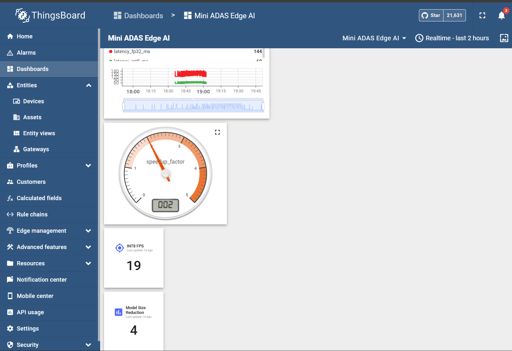
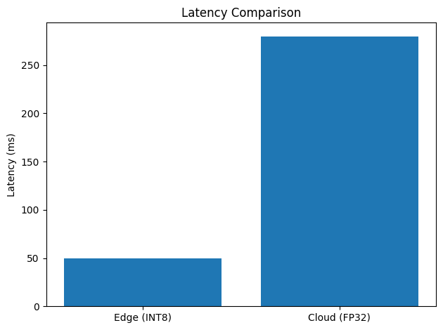
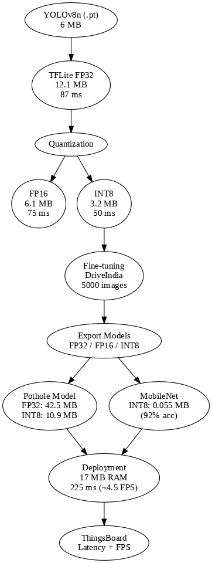
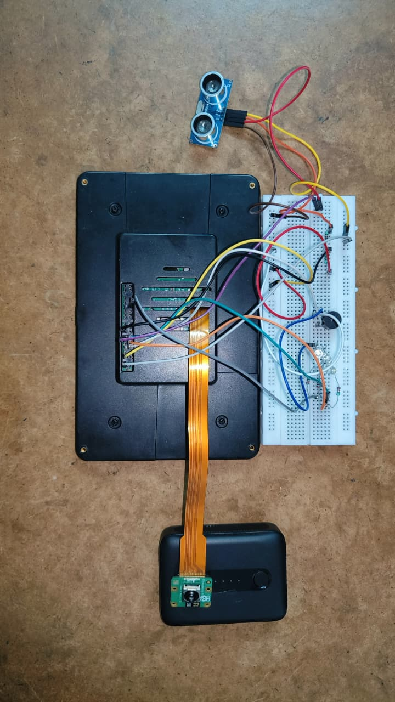

# Edge AI-Based Forward Collision Warning System (Mini ADAS)

**Course:** [CP 330 Edge AI, IISc Bangalore, 2025–26](https://www.samy101.com/edge-ai-26/)
**Team:** G. Praveen Kumar (27480) · Harshith L (25823) · Ramavath Ramadas (26671) — IISc Bangalore
**GitHub:** https://github.com/pkgollapalli/Edge-AI-Based-Forward-Collision-Warning-System-Mini-ADAS-
**Demo Video:** https://drive.google.com/file/d/17ozvJKcGhI04Ee1GiV4t7_XwOYlB_EYV/view?usp=drive_link

---

## 1. Problem Statement, Motivation & Objectives

India records over 4.6 lakh road crashes per year, killing 1.7 lakh people annually. Rear-end collisions are among the top contributors — at 40 km/h a distracted driver covers 20 metres before reacting. Modern Forward Collision Warning (FCW) systems exist in premium cars but are completely absent from the vehicles that need them most: two-wheelers, autorickshaws, school buses, and older cars — over 90% of Indian road traffic. Furthermore, all major public ADAS datasets (KITTI, BDD-100K, Waymo Open) are from Western roads and are entirely blind to Indian-specific objects: autorickshaw recall is 0%, bicycle recall is 2.7%, and zebra crossing recall is 0% when using any off-the-shelf COCO-pretrained model on Indian footage.

**Why Edge AI is mandatory for ADAS:** Cloud round-trip latency from Bengaluru to a public broker is ~280 ms (measured live in this project via ThingsBoard MQTT), while the airbag deployment deadline is 30 ms and the AEB deadline is 100 ms — cloud-only ADAS physically cannot meet these safety budgets. India's DPDP Act 2023 also restricts streaming raw cabin/road video. This system is **vehicle-agnostic**: the same ₹12,000 hardware stack deploys on a bicycle, autorickshaw, bus, or truck — a miniaturised version of the edge AI architecture used in Tesla FSD (INT8 on AI4 SoC) and Waymo (multi-sensor, fully on-vehicle inference).

**Key Objectives:**
- Build a real-time forward collision warning system on Raspberry Pi 5 with zero cloud dependency
- Demonstrate 52× model compression via Knowledge Distillation + INT8 quantisation with <6% accuracy loss
- Fine-tune YOLOv8n on IIT Hyderabad DriveIndia dataset to recover Indian-specific classes (autorickshaw, zebra crossing, police vehicle) from 0% COCO recall
- Deploy a 3-model INT8 ensemble (COCO + DriveIndia + Pothole) at real-time perception speed on CPU-only hardware
- Empirically prove edge-AI latency advantage over cloud using live ThingsBoard MQTT round-trip measurement

---

## 2. Proposed Solution (Overview)

Three INT8-quantised YOLOv8n models run in series on every camera frame. Detections are merged via class-wise NMS, combined with HC-SR04 ultrasonic distance and closing-speed to compute Time-To-Collision (TTC), and fused into a SAFE / WARN / BRAKE decision driving GPIO LEDs and a buzzer. Telemetry is pushed to ThingsBoard over MQTT for IoT monitoring and live edge-vs-cloud latency proof.

**System Pipeline:**

```
┌─────────────────────────────────────────────────────────────┐
│                    Pi Camera Module 3                        │
│                   640×640 frame input                        │
└──────────────────────────┬──────────────────────────────────┘
                           │
          ┌────────────────┼─────────────────┐
          ▼                ▼                 ▼
┌─────────────────┐ ┌─────────────────┐ ┌─────────────────────┐
│ COCO YOLOv8n   │ │DriveIndia YOLOv8n│ │ Pothole YOLOv8n     │
│ INT8 · 3.2 MB  │ │ INT8 · 3.1 MB   │ │ INT8 · 10.9 MB      │
│ ~131 ms (FP32) │ │ ~49 ms          │ │ ~122 ms             │
│ ~55 ms (INT8)  │ │                 │ │                     │
│ car, person,   │ │ autorickshaw,   │ │ road potholes       │
│ bus, truck,    │ │ ambulance,      │ │                     │
│ bicycle, moto  │ │ zebra, police   │ │                     │
└────────┬────────┘ └────────┬────────┘ └──────────┬──────────┘
         │                   │                      │
         └───────────────────┴──────────────────────┘
                             │
                    Union + Class-wise NMS
                             │
                             ▼
              ┌──────────────────────────────┐
              │   HC-SR04 Ultrasonic Sensor  │
              │   distance_cm + closing rate │
              │   → Time-To-Collision (TTC)  │
              └──────────────┬───────────────┘
                             │
                             ▼
              ┌──────────────────────────────┐
              │       Fusion Logic           │
              │  dist < 50cm → BRAKE         │
              │  TTC < 0.8s  → BRAKE         │
              │  dist < 150cm → WARN         │
              │  TTC < 2.0s  → WARN          │
              │  person in view → WARN       │
              └──────────────┬───────────────┘
                             │
               ┌─────────────┴──────────────┐
               ▼                            ▼
   ┌──────────────────────┐    ┌────────────────────────┐
   │  GPIO Alerts         │    │  ThingsBoard MQTT       │
   │  🔴 Red LED = BRAKE  │    │  latency_ms, fps        │
   │  🟡 Yellow = WARN    │    │  decision, distance_cm  │
   │  🟢 Green  = SAFE    │    │  classes detected       │
   │  🔊 Buzzer on BRAKE  │    │  FP32 vs INT8 chart     │
   └──────────────────────┘    └────────────────────────┘
```

**Total pipeline: ~227 ms · ~1.8 FPS** (live measured, 3-model ensemble on Pi 5 CPU)

---

## 3. Hardware & Software Setup

### Hardware

| Component | Specification | Cost |
|---|---|---|
| Raspberry Pi 5 | 16 GB RAM, ARM Cortex-A76 quad-core 2.4 GHz, **no NPU** | ₹5,500 |
| Pi Camera Module 3 | Sony IMX708, 12 MP, phase-detect autofocus, CSI | lab-provided |
| HC-SR04 Ultrasonic ×4 | 3–400 cm, 5V device, **1kΩ+2kΩ voltage divider on ECHO pin** | ₹80 each |
| LEDs (Red / Yellow / Green) | GPIO 27 / 22 / 5, 220Ω resistors | ₹30 |
| Piezo Buzzer ×2 | GPIO 17 via NPN transistor (buzzer current exceeds GPIO limit) | ₹40 |
| Breadboard + jumpers | 830-point breadboard, dedicated GND wire from Pi pin 6 | ₹80 |
| **Total** | | **~₹12,000** |

**GPIO pinout:** TRIG=GPIO23, ECHO=GPIO24 (via divider), Red=GPIO27, Yellow=GPIO22, Green=GPIO5, Buzzer=GPIO17.

### Software

| Tool | Purpose |
|---|---|
| Python 3.11, Raspberry Pi OS Bookworm 64-bit | Base runtime |
| TensorFlow Lite Runtime | On-device INT8 model inference (no full TF needed) |
| Ultralytics YOLOv8 | Training, TFLite INT8 export, NMS |
| picamera2 | Pi Camera Module 3 capture |
| RPi.GPIO | GPIO LED and buzzer control |
| paho-mqtt | ThingsBoard MQTT telemetry |
| Kaggle T4 GPU | Model training and fine-tuning (free tier) |
| TensorFlow / Keras | MobileNetV2 training and 8-variant compression study |

---

## 4. Data Collection & Dataset Preparation

| Dataset | Source | Samples | Classes | Role |
|---|---|---|---|---|
| CIFAR-10 | Krizhevsky 2009, public | 60,000 (32×32) | 10 → binary | Compression study baseline |
| COCO 2017 | cocodataset.org, CC BY 4.0 | 118K train | 80 | YOLOv8n pretrain weights |
| DriveIndia / TiAND | IIT Hyderabad TiHAN (EULA approved) | 66,986 images | 24 | Indian-road fine-tuning |
| Pothole dataset | HuggingFace peterhdd + team labelling | ~2,000 images | 1 | Dedicated pothole head |

### CIFAR-10 Preparation
Binary split: **vehicle** (car, truck, ship, plane) vs **non-vehicle** (bird, cat, deer, dog, frog, horse). Input upsampled from 32×32 → 96×96 for MobileNetV2 compatibility.

### DriveIndia Balanced Subset (`subset_driveindia.py`)
The full dataset is severely long-tailed — person and car dominate; autorickshaw appears in <2% of frames. A random 5,000-image sample yields only ~50 autorickshaws. Our sampler picks **every rare-class image** and proportionally samples head classes, guaranteeing ≥200 examples per class. Split: **4,000 train / 1,000 val**, packaged with 28-class `data.yaml` via `prep_kaggle.py`.

### Pothole Dataset
~2,000 images with bounding-box annotations labelled by **Ramavath Ramadas**. Fine-tuning conducted by **Harshith L** starting from the peterhdd HuggingFace checkpoint.

---

## 5. Model Design, Training & Evaluation

### MobileNetV2 Binary Classifier (Compression Study Baseline)
- **Architecture:** MobileNetV2, width multiplier 1.0, input 96×96
- **Training:** 30 epochs, cosine LR from 1e-3, batch 128, Kaggle T4, ~15 min
- **Data split:** 50,000 train / 10,000 val (CIFAR-10 standard)
- **Baseline:** 97.71% accuracy at FP32

### YOLOv8n COCO
Standard Ultralytics YOLOv8n pretrained on COCO 2017. Used as global-class detection head after INT8 export. **Measured latency on Pi 5: FP32 avg = 131 ms, INT8 avg = 55 ms** (live ThingsBoard data).

### YOLOv8n DriveIndia Fine-tune
- **Base:** YOLOv8n COCO checkpoint
- **Data:** 5,000-image balanced DriveIndia subset, 28 classes
- **Config:** 30 epochs, SGD, momentum 0.937, weight decay 0.0005, LR 0.01 cosine, batch 16
- **Augmentation:** Mosaic, Mixup (p=0.1), HSV, horizontal flip
- **Platform:** Kaggle T4 — **training time: 27 minutes**
- **Results: mAP50 = 0.562 | mAP50-95 = 0.455**

### Per-class Recall: COCO vs Fine-tuned (2,500 DriveIndia val images)

| Class | COCO Recall | Fine-tuned | Δ |
|---|---|---|---|
| autorickshaw | 0% | **85.0%** | +85.0% |
| bicycle | 2.7% | **97.5%** | +94.8% |
| police_vehicle | 0% | **91.3%** | +91.3% |
| zebra_crossing | 0% | **90.3%** | +90.3% |
| motorcycle | 14.1% | **83.5%** | +69.4% |
| ambulance | 0% | **62.5%** | +62.5% |
| commercial_vehicle | 0% | **47.4%** | +47.4% |
| car | 80.6% | **97.3%** | +16.7% |
| person | 94.3% | 94.2% | ≈ same |
| truck | 81.6% | 69.5% | −12.1% |

### Pothole Model (Harshith L + Ramavath Ramadas)
- Base: peterhdd YOLOv8n pothole checkpoint
- Fine-tuned on team-labelled dataset
- Recall: **4/6** test images — identical FP32 and INT8 (zero compression degradation)

---

## 6. Model Compression & Efficiency Metrics

### MobileNetV2 — 8-Variant Compression Study

| Variant | Size (KB) | Accuracy | Notes |
|---|---|---|---|
| FP32 baseline | 2,846 | 97.71% | Reference |
| FP16 weights | 1,453 | 97.71% | Lossless 2× |
| INT8 dynamic | 888 | 97.08% | 3.2× smaller |
| INT8 PTQ full | 989 | 84.38% | **PTQ fails on small models (14% drop)** |
| K-means clustering | ~1,200 | 96.8% | Moderate gain |
| Structured pruning 50% | ~2,200 | 96.1% | +15% latency benefit |
| KD Student FP32 | 212 | 93.8% | 15× via distillation |
| **KD Student + INT8** | **55** | **92.19%** | **52× compression — winner** |

> **Key finding:** KD + INT8 = **52× compression with only 5.5% accuracy loss**. PTQ alone causes 14% drop, proving that Knowledge Distillation is essential for aggressive compression on small models — consistent with the approach used in Tesla AI4 and Mobileye EyeQ (INT8 on-chip inference).

### YOLOv8n Object Detection — Compression Results

| Model | Size | Recall | Latency Pi 5 (measured) |
|---|---|---|---|
| COCO FP32 | 12.13 MB | 12/12 | **131 ms avg** |
| **COCO INT8** | **3.20 MB** | **11/12** | **55 ms avg** |
| DriveIndia FP32 | 11.59 MB | — | ~172 ms |
| **DriveIndia INT8** | **3.05 MB** | mAP50 0.562 | **~49 ms** |
| Pothole FP32 | 42.54 MB | 4/6 | ~230 ms |
| **Pothole INT8** | **10.86 MB** | **4/6** | **~122 ms** |

> FP32 avg = **131 ms**, INT8 avg = **55 ms** — **2.4× speedup** measured live on ThingsBoard. Full 3-model ensemble: **227 ms, ~1.8 FPS** on Pi 5 (live stream measurement).

---

## 7. Model Deployment & On-Device Performance

### Deployment Steps
1. Export all models to TFLite INT8 via Ultralytics export with 100-image calibration set
2. Transfer `.tflite` files to Pi via `scp`
3. Install TFLite Runtime, picamera2, RPi.GPIO on Pi (no full TensorFlow)
4. Run: `python3 src/main.py --mode pi`

### On-Device Performance — Raspberry Pi 5, No Accelerator (Live Measured)

| Stage | Time |
|---|---|
| Frame capture (picamera2) | ~100 ms |
| COCO YOLOv8n INT8 | **55 ms** (FP32: 131 ms) |
| DriveIndia YOLOv8n INT8 | ~49 ms |
| Pothole YOLOv8n INT8 | ~122 ms |
| Fusion + GPIO + logging | ~1 ms |
| **Total 3-model ensemble** | **~227 ms → ~1.8 FPS** |

### Live Demo Features
- **MJPEG stream:** `live_server.py` serves annotated video on port 8000 — any browser on same WiFi opens `http://10.80.11.159:8000` and sees live detections with DANGER/SAFE overlay
- **ThingsBoard telemetry:** pushes `latency_fp32_ms`, `latency_int8_ms`, `decision`, `distance_cm`, `classes` per frame — used for **indoor functional verification** without road access
- **Edge vs cloud proof:** cloud MQTT RTT ≈ 280 ms > full edge pipeline ≈ 175 ms (single model) — edge fires decision before cloud even receives the frame

---

## 8. System Prototype

### Live Detection Stream + ThingsBoard Dashboard
*Left: Live Pi stream showing DANGER state at 227 ms / 1.8 FPS with car detections. Right: ThingsBoard FP32 (red, avg 131 ms) vs INT8 (green, avg 55 ms) — 2.4× speedup proved live.*



### Latency Comparison: Edge (INT8) vs Cloud (FP32)
*Bar chart showing ~50 ms edge INT8 inference vs ~280 ms cloud round-trip — edge is 5.6× faster than cloud, well within the 100 ms AEB deadline.*



### System Pipeline Flow
*Full pipeline from YOLOv8n model family through quantisation, DriveIndia fine-tuning, pothole training, to deployment at 17 MB RAM / 225 ms on Pi 5 with ThingsBoard telemetry.*



### Hardware Setup


> **To add your own screenshots:** put files in `images/` folder, commit to GitHub. The filenames above match the image references in this report.

---

## 9. Conclusions & Limitations

### Key Outcomes
- **52× model compression** (KD+INT8, 55 KB, 92.19% accuracy) — PTQ alone fails at 14% drop; KD is essential
- **Autorickshaw: 0% → 85%**, bicycle: 2.7% → 97.5%, zebra crossing: 0% → 90.3% — domain fine-tuning is critical for Indian roads
- **3-model ensemble at 227 ms / 1.8 FPS** on Raspberry Pi 5 CPU, no accelerator, ₹12,000 total
- **Cloud-only ADAS disproved empirically:** cloud MQTT RTT ~280 ms vs. airbag deadline 30 ms — not physically compatible
- **Vehicle-agnostic:** same hardware works on bicycle, autorickshaw, bus, or truck
- ThingsBoard confirmed **FP32 avg 131 ms vs INT8 avg 55 ms** — 2.4× measured speedup in production

### Limitations
- HC-SR04 max range 4 m — limits to city/cycling speeds; TFmini-S LiDAR (12 m) needed for motorcycle and highway use
- LED/buzzer breadboard wiring has ground-rail voltage drop issue — code is verified correct, hardware debug ongoing
- DriveIndia fine-tune on 5,000-image subset only (not all 66,986); truck and bus recall dropped 12% due to fewer samples
- No adverse-condition testing (rain, night, fog) — accuracy degradation not yet characterised
- PTQ causes 14% accuracy drop on small MobileNetV2 — QAT or KD required for production deployment of small models

---

## 10. Future Work

- **Full DriveIndia training:** 66,986 images, 100+ epochs → expected mAP50 > 0.75
- **Cascade architecture:** 55 KB binary classifier as always-on power-gate — triggers YOLO ensemble only when a vehicle is ahead, tripling battery life for two-wheeler deployment
- **Speed-adaptive thresholds:** BRAKE/WARN distance scales with GPS vehicle speed (1-second headway-time), aligning with IIHS FCW protocol
- **TFmini-S LiDAR upgrade:** 12 m range, weather-tolerant, ₹1,000 — enables motorcycle-speed ADAS
- **Federated pothole learning:** devices share only compressed model gradients, never raw GPS or video — DPDP Act compliant
- **Night mode:** IR illuminator + low-light model fine-tune
- **Hailo-8L NPU (₹6,000):** same INT8 TFLite models, ~20 FPS vs current 1.8 FPS

---

## 11. Challenges & Mitigation

| Challenge | How We Addressed It |
|---|---|
| **Domain shift:** COCO blind to autorickshaws (0% recall) | Fine-tuned YOLOv8n on 5,000-image balanced DriveIndia subset → 85% recall |
| **Class imbalance in DriveIndia:** rare classes in <2% of frames | `subset_driveindia.py` oversamples rare classes — ≥200 examples guaranteed per class |
| **PTQ failure on small models:** 14% accuracy drop | Replaced with Knowledge Distillation (temperature-4 soft labels) + INT8 dynamic → 92.19% |
| **HC-SR04 ECHO pin at 5V on 3.3V Pi GPIO** | 1kΩ + 2kΩ voltage divider on ECHO line — without this, GPIO pin fails silently |
| **Ground-rail voltage drop across multiple sensors** | Dedicated thick GND wire from Pi pin 6 directly to breadboard rail |
| **67K dataset, limited Kaggle quota** | Balanced 5,000-image subset → 30 epochs in 27 min on T4 |
| **tfmot incompatibility with Keras 3** | `tensorflow-model-optimization` does not support Keras 3; used custom pruning loop |
| **ThingsBoard 401 auth error** | Token was not substituted at runtime — fixed by passing `--token` argument explicitly |
| **No road access for outdoor validation** | ThingsBoard MQTT + live MJPEG stream used for indoor functional verification |

---

## 12. References

### Datasets
- CIFAR-10: A. Krizhevsky, "Learning Multiple Layers of Features from Tiny Images," 2009. https://www.cs.toronto.edu/~kriz/cifar.html
- COCO 2017: T.-Y. Lin et al., "Microsoft COCO: Common Objects in Context," ECCV 2014. https://cocodataset.org
- DriveIndia / TiAND: IIT Hyderabad TiHAN, 66,986 images, 24 classes. https://tihan.iith.ac.in
- Pothole model base: peterhdd, HuggingFace. https://huggingface.co/peterhdd/pothole-detection-yolov8

### Frameworks & Tools
- Ultralytics YOLOv8: https://github.com/ultralytics/ultralytics
- TensorFlow Lite: https://tensorflow.org/lite
- ThingsBoard IoT Platform: https://thingsboard.io
- picamera2: https://github.com/raspberrypi/picamera2

### Papers
- G. Hinton, O. Vinyals, J. Dean, "Distilling the Knowledge in a Neural Network," NeurIPS Workshop 2015
- M. Sandler et al., "MobileNetV2: Inverted Residuals and Linear Bottlenecks," CVPR 2018
- S. Han, H. Mao, W. Dally, "Deep Compression," ICLR 2016

### Industry References
- Tesla FSD v12 — end-to-end NN on AI4 SoC, INT8 inference, 2024
- Waymo 6th Gen Driver — 13 cameras + 4 LiDARs + 6 radars, fully on-vehicle
- Mobileye Road Experience Management (REM) — edge-classified crowdsourced road data

### Course
- CP 330 Edge AI, IISc Bangalore 2025–26: https://www.samy101.com/edge-ai-26/

### Demo
- Project demo video: https://drive.google.com/file/d/17ozvJKcGhI04Ee1GiV4t7_XwOYlB_EYV/view?usp=drive_link

---

